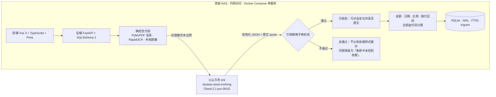

# 保单簿 PolicyBook

家庭保单管理与条款解读应用。把散落在抽屉、各家保险公司 App 和手机相册里的保单集中建档，然后回答三个具体问题：家里买了什么、这件事赔不赔、大概能赔多少。

整套服务部署在家庭 NAS 或内网单机上，原始合同、真实姓名与证件号不出内网；发送给大模型的内容一律先在本地脱敏。

推理核心使用火山方舟上的 `doubao-seed-evolving`（Seed-2.1-pro-0915），并保留基线模型用于同题集对照；模型端点可在 `config/models.yaml` 中配置，同时支持方舟与 OpenAI 兼容两类 provider。

---

## 核心设计原则

保险场景里一次说错话的代价很高，一个免赔额记错或一句“这个能赔”，家人可能真的据此决定要不要就医、要不要续保。因此本项目把职责划得很清楚。

**模型只负责理解、抽取、解释与对话。** 页面分类、字段抽取、责任项抽取、条款问答、理赔事实提取由模型完成，输出一律是原文字符串。

**凡是能被验证的交给模型，不能被验证的交给代码。** 金额、日期、比例、赔付估算、对比矩阵对齐全部由确定性代码计算。模型把某句话从第几页摘出来，摘错了可以通过子串校验发现；模型若顺手把免赔额算进赔付金额，算错了无从发现。

**每条引用都要过精确子串校验。** 模型返回的 quote 必须是该页文本在空白归一化后的精确子串，高亮坐标由代码从字符坐标图回算，不采信模型给出的任何位置信息。校验不通过的内容不允许以“有依据”的样式展示；条款问答中若一次回答的全部引用都未通过，结论直接降级为“条款中未找到依据”。

**失败必须披露。** 续保检索或文档下载失败时，报告明确写出“检索未完成”与原因，不使用模型记忆补齐产品事实。相关措辞由代码拼装，不交给模型自行决定是否承认失败。

---

## 架构



不越过内网边界的内容：保单原件与页面图片、真实姓名、证件号、银行卡号、脱敏映射表、API Key。脱敏失败的页面直接不发送，界面提示转人工。

---

## 功能

### 建档与核对

上传 PDF 或手机照片后，代码先算哈希去重，用 PyMuPDF 逐页渲染并保留文本层与字符坐标，文本层过稀的页转本地 RapidOCR，随后完成脱敏。模型接手判定页面类型、抽取基本信息与责任项，每个字段附带页码与原文 quote。代码再做引用校验与数值一致性校验，生成核对任务。

核对页左右双栏，左边字段表单，右边原文页面，点击字段右侧滚动定位并高亮。字段状态分为已校验、待确认、未找到、冲突四类；冲突字段全部处理完才允许确认入库。字段可人工修改，修改后标记为人工值并保留模型原值。

### 本地脱敏

| 类型 | 识别方式 | 替换 |
|---|---|---|
| 身份证号 | 正则 + GB 11643 校验位 | `〔证件1〕` |
| 手机号 | 正则 | `〔电话1〕` |
| 银行卡号 | 正则 + Luhn 校验 + 上下文关键词 | `〔卡号1〕` |
| 邮箱 | 正则 | `〔邮箱1〕` |
| 成员姓名 | 与登记的真实姓名精确匹配 | 成员占位符 |
| 保单号 | 字段上下文规则 | `〔保单号〕` |
| 详细地址 | 关键词后的同行文本 | `〔地址〕` |

文本与图片两个层面同步处理，图片打码位置来自文本层坐标或 OCR 框。映射表使用 `APP_SECRET` 派生的密钥加密保存，同一份文档内占位符保持稳定，模型仍能区分不同主体。界面提供“查看发送给模型的内容”预览。

### 条款问答

本地全文检索召回相关条款、释义与责任项，按保单聚合后送模型。回答结构固定为结论类别、理由步骤、引用列表、需向保险公司确认的事项。结论类别只有四个取值：可能赔付、可能不赔、视情况而定、条款中未找到依据。最后一项是专门留出的出口，用于在条款确无依据时如实拒答。

### 理赔情景模拟

模型从自然语言描述中提取事实、匹配可能涉及的保单与责任项并给出条款依据，全部金额由代码计算：社保报销、多份医疗险按小额到百万的顺序依次抵扣、年度与单次免赔额、经社保与未经社保两档赔付比例、定额给付不与医疗费用互抵、等待期内责任项排除出合计。输出为费用瀑布图，每一步给出低到高的区间，而不是一个精确数字。

### 家庭总览与保障覆盖

保障时间轴以成员为纵轴、时间为横轴，区分等待期段与生效段，保单之间的空档以红色虚线标出。六维保障雷达覆盖身故、重疾、医疗、意外、收入中断、养老，按“有效保额 / 参考保额”计算并封顶 120% 显示，参考保额由用户自行配置。缺口热力图以成员与风险类型交叉呈现覆盖程度。

### 续保顾问

按状态机推进：加载当前保单作为基线，收集需求，对照险种缺口清单找出未确认的维度，每轮追问不超过两项并附上“为什么问”，随后检索、下载条款、抽取候选产品责任项、按维度对齐生成对比矩阵、输出报告与客服问题清单。

检索与下载只接受 `config/domains.yaml` 白名单内的保险公司官网与监管披露平台域名，回环地址、私有网段、云主机元数据地址与非 http(s) 协议一律拒绝；域名校验通过后锁定安全 IP 直连，同时保留正确的 TLS 证书校验，规避 DNS rebinding。

### 报告导出与提醒

全家保单 PPT 由代码按模板生成版式与数字，模型只负责每页的一段中文摘要；生成后代码重新读取 PPT，逐项比对数字与数据库是否一致。到期前 60/30/7 天、等待期结束与缴费日生成提醒，并提供 ICS 订阅地址供内网手机日历订阅。

---

## 技术栈

| 层 | 选型 |
|---|---|
| 后端 | Python 3.12、uv、FastAPI、SQLAlchemy 2、Pydantic v2 |
| 存储 | SQLite（WAL + FTS5 trigram 全文检索） |
| 文档处理 | PyMuPDF、Pillow、pillow-heif、RapidOCR（ONNX Runtime，本地推理） |
| 报告 | python-pptx（版式与数字由代码生成，生成后回读核验） |
| 任务与提醒 | APScheduler、icalendar |
| 前端 | Vue 3、TypeScript、Vite、Pinia、Vue Router、Reka UI、原生 CSS |
| 图表与图标 | vue-echarts、lucide-vue-next |
| 部署 | Docker Compose 单服务，x86_64 与 arm64 |

字体、图标与脚本全部本地打包，运行时不依赖外网 CDN。

---

## 快速开始

### 前置条件

- [uv](https://docs.astral.sh/uv/)（Python 包与环境管理）
- Node.js 与 pnpm（可选，仅在需要前端开发模式时；缺失时后端会直接托管已构建的前端产物）
- 火山方舟 API Key（模型相关功能需要）

### Windows 一键启动

```bat
启动PolicyBook.bat
```

脚本会依次检查 uv 与前端环境、生成 `.env` 与 `APP_SECRET`、创建数据目录与数据库结构、释放被占用的端口、拉起服务并执行健康检查，最后打印访问地址。清空测试数据用 `清空测试数据.bat`。

### 手动启动

```bash
# 首次运行：生成 .env、数据目录与数据库结构
cd backend
uv run python -m app.scripts.init

# 后端
uv run uvicorn app.main:app --host 127.0.0.1 --port 8000

# 前端开发模式（另开一个终端；不需要时可跳过，后端会托管 frontend/dist）
cd frontend
pnpm install
pnpm dev
```

后端单端口模式访问 `http://127.0.0.1:8000`，前端开发模式访问 `http://127.0.0.1:5173`，接口文档在 `http://127.0.0.1:8000/api/docs`。

### Docker Compose

```bash
cd docker
docker compose up -d --build
```

镜像为多阶段构建：`node:22-slim` 构建前端，`python:3.12-slim` 作为运行时并托管构建产物。容器内监听 8000，compose 默认映射到宿主 `8080`，`./data` 与 `./models` 挂载为数据卷，环境变量取自仓库根目录的 `.env`。镜像可选打包 LibreOffice（构建时传入 `--build-arg WITH_LIBREOFFICE=true`），为后续的 PPT 渲染校验预留。

### 首次登录

首次打开会进入“设置家庭密码”页面，密码至少 4 位，设置后以 PBKDF2 哈希存入数据库。也可以在 `.env` 的 `FAMILY_PASSWORD` 中预置一个一次性引导密码，登录成功后会落库为哈希，此后不再读取该环境变量。

`FAMILY_PASSWORD` 留空时，等号后不要跟空格或行内注释，否则 dotenv 会把注释文本当成密码值读入。

---

## 配置

### 环境变量（`.env`，可从 `.env.example` 复制）

| 变量 | 说明 |
|---|---|
| `APP_HOST` / `APP_PORT` | 服务监听地址与端口 |
| `DATA_DIR` / `MODELS_DIR` | 数据目录与本地模型目录 |
| `APP_SECRET` | 应用密钥，用于脱敏映射表加密与会话签发；由初始化脚本随机生成 |
| `FAMILY_PASSWORD` | 可选的一次性引导密码，留空则在界面首次设置 |
| `ARK_API_KEY` | 火山方舟 API Key |
| `ARK_BASE_URL` | 方舟接口地址，仅覆盖 provider 为 `ark` 的模型 |
| `MODEL_PRIMARY` / `MODEL_BASELINE` | 主测与基线模型 ID |
| `SOFFICE_PATH` | LibreOffice 可执行文件路径，为 PPT 渲染校验预留，当前代码尚未启用 |
| `HTTP_PROXY` | 可选出网代理 |
| `EVAL_MODE` | 测评模式开关，开启后可注入搜索工具故障 |

`.env` 已在 `.gitignore` 中，API Key 与 `APP_SECRET` 不会进入版本库。

### 配置文件

| 文件 | 内容 |
|---|---|
| `config/models.yaml` | 模型端点定义，含 provider、base_url、model_id、api_key_env 与能力声明 |
| `config/domains.yaml` | 续保检索出网白名单域名 |
| `config/gaps/accident.yaml` | 意外险缺口清单与追问维度 |

---

## 页面与接口

| 页面 | 路径 | 首屏回答的问题 |
|---|---|---|
| 家庭总览 | `/` | 全家现在保障状态如何，有什么要处理 |
| 保单库 | `/policies` | 家里有哪些保单 |
| 保单详情 | `/policies/:id` | 这张保单保什么、不保什么 |
| 上传建档 | `/import` | 抽得对不对 |
| 核对任务 | `/import/:jobId` | 逐字段核对与确认入库 |
| 条款问答 | `/ask` | 这件事赔不赔 |
| 理赔模拟 | `/claim` | 大概能赔多少 |
| 续保顾问 | `/renewal` | 今年要不要调整 |
| 家庭成员 | `/members` | 成员信息与参考保额 |
| 报告导出 | `/reports` | 生成可分享的材料 |
| 测评看板 | `/eval` | 各模型在同题集上的表现 |
| 系统设置 | `/settings` | 模型、日历订阅、参考保额、界面偏好 |

接口统一挂在 `/api` 下，按模块划分为 `auth`、`settings`、`members`、`imports`、`documents`、`policies`、`qa`、`claim`、`overview`、`coverage`、`renewal`、`reports`、`eval`。除 `/api/health` 与 `/api/auth/*` 外全部需要登录；日历 ICS 订阅端点使用独立随机 token，不走登录校验。完整接口文档见运行时的 `/api/docs`。

---

## 数据与隐私

家庭密码登录，会话令牌基于 Fernet 对称加密签发，有效期 7 天，Cookie 设置 `HttpOnly` 与 `SameSite=Lax`。项目按纯内网 HTTP 部署设计，未设置 `Secure` 标志；若需映射到公网，请自行在前置反向代理上启用 HTTPS 并相应调整 Cookie 属性。

登录接口带有基于内存的失败次数限制。原始文件按哈希命名存放于数据目录，脱敏映射表加密保存，数据库与数据目录均不进入版本库。

---

## 开发与测试

```bash
# 后端测试
cd backend
uv run pytest tests/ -v

# 前端类型检查与构建
cd frontend
pnpm typecheck
pnpm build
```

当前后端测试 75 项全部通过，覆盖脱敏识别、引用校验与坐标回算、中文金额与日期解析、理赔计算规则、六维保额与缺口、白名单与 SSRF 防护、鉴权与会话过期、违禁措辞过滤、PPT 生成与回读核验等。

设计系统预览页在 `/dev/styleguide`，可查看设计令牌、玻璃层级与组件样式。

---

## 目录结构

```
backend/          FastAPI 应用
  app/api/        接口路由
  app/auth/       家庭密码与会话
  app/ingest/     渲染、OCR、脱敏、抽取
  app/claim/      理赔计算引擎
  app/coverage/   六维保额与时间轴
  app/renewal/    续保状态机、检索、白名单与对比矩阵
  app/reports/    PPT 生成与回读核验
  app/llm/        模型适配层与提示词
  app/utils/      引用校验、中文数值解析、合规过滤
  tests/          测试套件
frontend/         Vue 3 单页应用
config/           模型端点、出网白名单、险种缺口清单
docker/           Dockerfile 与 Compose 编排
scripts/          启动与数据重置脚本
```

---

## 已知限制

模型的多模态视觉通道尚未接入，扫描件与照片目前依赖本地 OCR 转文本后走同一条链路，OCR 质量不佳的页需在核对页人工兜底；PPT 的视觉检查同理，目前只有代码回读数字这一层，没有交给模型做版面检查。续保顾问的白名单校验、SSRF 防护、URL 溯源与失败披露链路均已实现，但检索与下载当前使用离线数据源，实时联网检索还未接上。权限为单一家庭密码，成员级权限尚未实现。

测评看板读取仓库外的本地 `eval/` 目录，任务集与跑批结果不随仓库同步。

---

## 免责说明

保单簿根据上传的合同文本整理信息，帮助理解条款和估算大致范围。所有结论以保险公司的核定和合同原文为准，本工具不构成投保建议、核保意见或理赔承诺。
